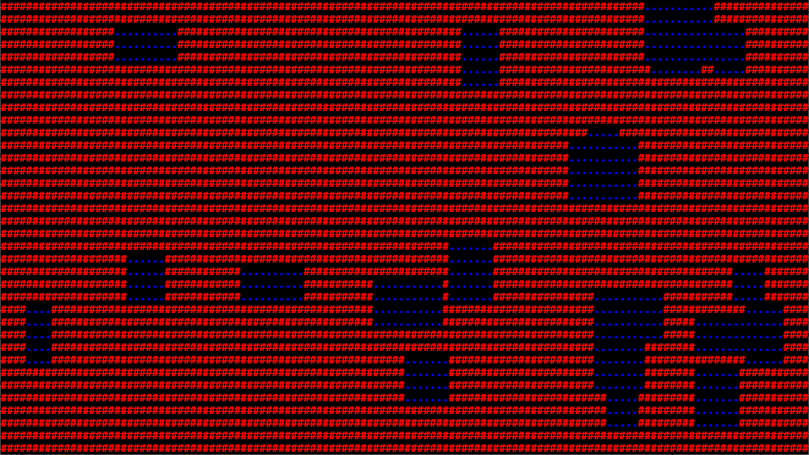

# roguelike experiment

    

This code is not organized, safe, idiomatic, efficient, or bug-free. This is an extremely naive text-based rendering engine built on top of [`wgpu-rs`](https://github.com/gfx-rs/wgpu-rs) using the [`wgpu_glyph`](https://github.com/hecrj/wgpu_glyph) library to actually render text. A trivial "map-generation" algorithm produced the layout of tiles you see above.

The font used is Fira Mono, which is licensed under the [Open Font License](https://scripts.sil.org/cms/scripts/page.php). A copy of the license can be found in `./resources/fonts/OFL.txt`.

Only Windows is known to work, though the code should be fully adaptable to other operating systems, and the browser.
